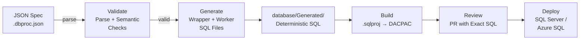
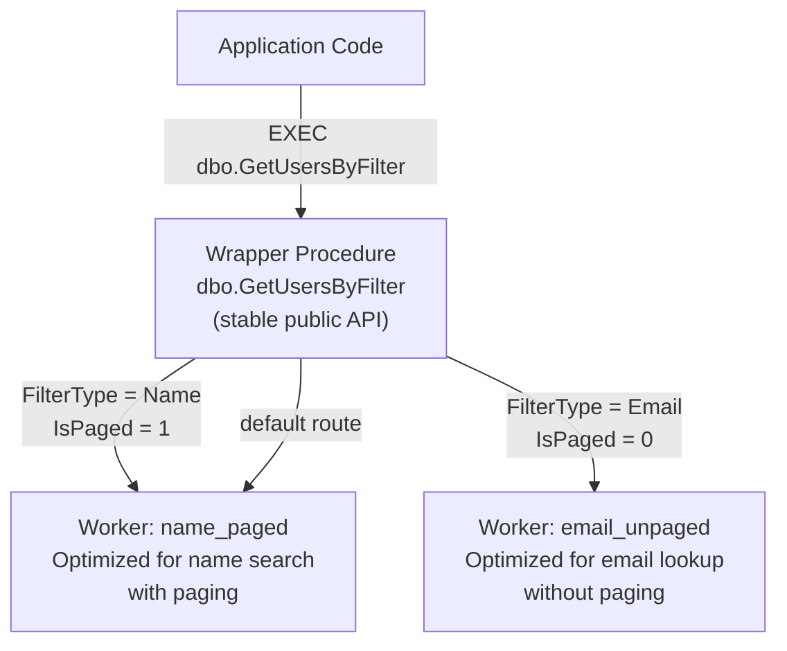
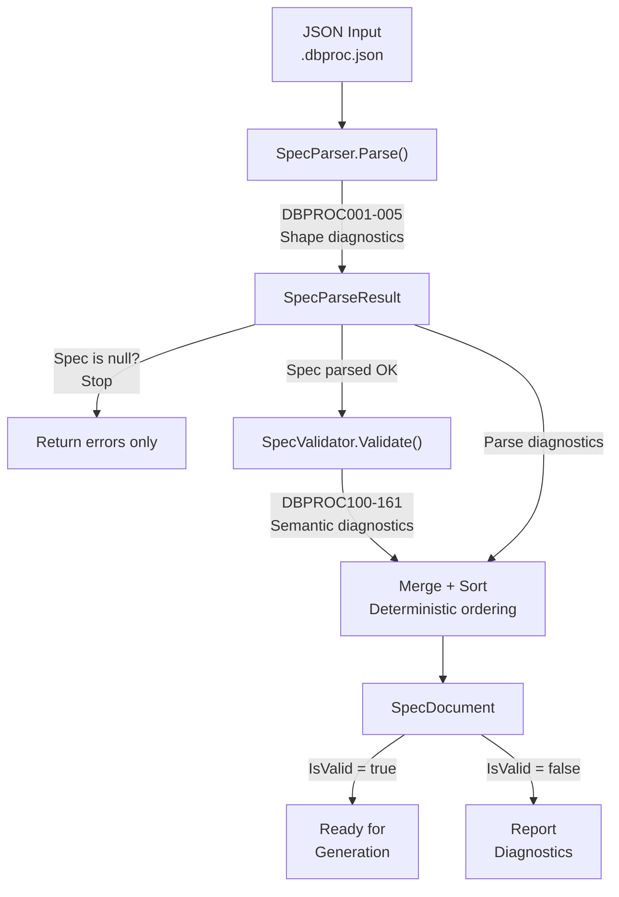

# DbProcGen

**Build-time generation of specialized stored procedures from declarative specs while maintaining a stable public SQL API.**

## Problem Statement

SQL Server stored procedures often serve multiple distinct usage patterns with different plan-shaping needs:

- A search procedure that handles both paging and non-paging queries
- A lookup procedure that needs different access patterns for different object types
- Complex procedures where parameter combinations affect cardinality dramatically

Historically, teams either:
- Hand-maintained multiple specialized procedures (error-prone, costly to sync)
- Used runtime dynamic SQL rewrites (harder to review, harder to debug, risky)
- Forced one procedure to handle all patterns (poor execution plans, parameter sniffing issues)

**DbProcGen solves this by generating specialized stored procedures at build time from a single declarative source**, keeping the public SQL API stable while the implementation branches only where it matters most.

## Scope: v1

This project focuses on:

- **Spec format:** JSON-based declarative procedure definitions (`*.dbproc.json`)
- **Generation:** CLI-first tool to read specs and emit deterministic SQL artifacts
- **Deployment:** SQL Database Project (`.sqlproj`) as the source of truth
- **Output:** Wrapper procedures (stable public API) + specialized worker procedures (implementation variants)
- **Validation:** Build-time checks to ensure generated SQL is deterministic and consistent

Out of scope for v1:
- Roslyn integration (optional for later)
- YAML spec format (v2+ candidate)
- Runtime SQL synthesis as a default behavior
- Generic parameter combination explosion

## Repository Layout

```text
src/
  DbProcGen.Tool/         # CLI entry point: generate, validate, clean
  DbProcGen.Spec/         # Spec model, parser, validator
  DbProcGen.Generator/    # Core generation pipeline
  DbProcGen.Model/        # Shared domain types
  DbProcGen.Runtime/      # Optional runtime-facing routing helpers

tests/
  DbProcGen.Spec.Tests/       # Spec parsing and validation tests
  DbProcGen.Generator.Tests/  # Generator logic tests
  DbProcGen.Runtime.Tests/    # Runtime helper tests
  DbProcGen.Database.Tests/   # Database integration tests

database/
  DbProcGen.Database.sqlproj  # SQL project (build target for deployment)
  Schema/                     # Hand-authored schema (tables, views, etc.)
  Generated/                  # Generated SQL only (deterministic, checked-in)

specs/
  <domain>/<logical-name>.dbproc.json  # Declarative procedure specs

docs/
  adr/                        # Accepted architectural decisions (binding for v1)
  architecture.md             # End-to-end flow and design rationale
```

## Workflow: Spec → Generated SQL → Deployment



1. **Author spec** — Write a `.dbproc.json` in `specs/`
2. **Generate** — `dotnet run --project src/DbProcGen.Tool -- generate` reads, validates, and emits SQL
3. **Generated SQL** — Deterministic files appear in `database/Generated/`
4. **Build** — `dotnet build database/DbProcGen.Database.sqlproj` compiles into a DACPAC
5. **Review** — PR shows exact SQL changes for code review
6. **Deploy** — Standard DACPAC deployment to SQL Server / Azure SQL

## Wrapper and Worker Pattern



Application code calls a single stable wrapper procedure. The wrapper routes to specialized worker procedures based on parameter values. Workers are optimized for specific query plan shapes — callers never reference them directly.

## Spec Processing



`SpecDocumentFactory.ParseAndValidate()` runs the JSON through two stages: `SpecParser` checks structural shape (DBPROC001–005), then `SpecValidator` checks semantic rules (DBPROC100–161). Diagnostics from both stages are merged in deterministic order.

## SQL File Organization

**Separation rule:** do not mix hand-authored and generated SQL in the same files.

- `database/Schema/` — hand-written SQL only (create tables, indexes, views, schemas)
- `database/Generated/` — auto-generated SQL only (wrapper and worker procedures)

Generated files are deterministic and regenerated idempotently from specs. Do not edit generated files manually.

## Build and Test Commands

```bash
# Restore dependencies
dotnet restore

# Build .NET projects
dotnet build DbProcGen.slnx

# Validate specs (check JSON schema and semantic rules)
dotnet run --project src\DbProcGen.Tool -- validate

# Generate SQL from specs
dotnet run --project src\DbProcGen.Tool -- generate

# Check environment and prerequisites
dotnet run --project src\DbProcGen.Tool -- doctor

# Show differences between specs and generated artifacts (placeholder)
dotnet run --project src\DbProcGen.Tool -- diff

# Run tests
dotnet test --project tests\DbProcGen.Spec.Tests
dotnet test --project tests\DbProcGen.Tool.Tests
dotnet test --project tests\DbProcGen.Generator.Tests
dotnet test --project tests\DbProcGen.Runtime.Tests
dotnet test --project tests\DbProcGen.Database.Tests

# Build SQL project (compiles Schema/ + Generated/ into DACPAC)
dotnet build database\DbProcGen.Database.sqlproj
```

## Visual Studio 2026 Usage

- For daily coding in Visual Studio 2026, open `DbProcGen.Dev.slnx` (excludes the SQL project to avoid sqlproj load stalls).
- Keep CLI/full-path builds on `DbProcGen.slnx` as-is.
- Build the SQL project separately when needed:

```bash
dotnet build database/DbProcGen.Database.sqlproj
```

## Specs

Procedure definitions live in `specs/` as JSON files (`*.dbproc.json`). See [specs/README.md](specs/README.md) for layout and format details.

## Architectural Decisions (ADRs)

These ADRs are binding constraints for v1. For detailed context and rationale, see:

- **[ADR 0001](docs/adr/0001-build-time-generation.md)** — Build-time generation (not runtime dynamic SQL)
- **[ADR 0002](docs/adr/0002-sqlproj-as-source-of-truth.md)** — SQL Database Project as deployment source of truth
- **[ADR 0003](docs/adr/0003-json-spec-format-v1.md)** — JSON for v1 specs (YAML deferred)
- **[ADR 0004](docs/adr/0004-wrapper-and-worker-procedures.md)** — Wrapper + worker procedure pattern
- **[ADR 0005](docs/adr/0005-deterministic-generated-artifacts.md)** — Commit deterministic artifacts to git
- **[ADR 0006](docs/adr/0006-cli-first-roslyn-optional.md)** — CLI-first; Roslyn integration deferred

## Status: End-to-End Proof Complete

The repository demonstrates a complete end-to-end generation flow for one procedure family:

**Example: GetUsersByFilter**
- **Spec:** `specs/users/GetUsersByFilter.dbproc.json`
- **Hand-authored schema objects:** 
  - `database/Schema/Tables/Users.sql` (base user table)
  - `database/Schema/Views/UsersForGetUsersByFilter.sql` (query projection)
- **Generated artifacts:** `database/Generated/`
  - Wrapper: `dbo_GetUsersByFilter.sql` (stable public API with concrete IF/ELSE routing)
  - Workers: 
    - `dbo_GetUsersByFilter_name_paged.sql` (paginated name search using OFFSET/FETCH)
    - `dbo_GetUsersByFilter_email_unpaged.sql` (unpaged email lookup with direct equality)
  - Manifest: `generation-manifest.json` (shows which variants were emitted and why)

### Generated Shape and ADR Mapping

This proof validates all binding ADRs with realistic, working SQL:

| ADR | Requirement | Implementation |
|-----|-------------|----------------|
| [ADR 0001](docs/adr/0001-build-time-generation.md) | Build-time generation | CLI `generate` command reads specs, produces deterministic SQL at build time |
| [ADR 0002](docs/adr/0002-sqlproj-as-source-of-truth.md) | SQL project source-of-truth; schema separation | Generated SQL in `database/Generated/`, hand-authored in `database/Schema/`, both included in `.sqlproj`, deployed via DACPAC |
| [ADR 0004](docs/adr/0004-wrapper-and-worker-procedures.md) | Wrapper + workers with concrete routing | One public wrapper with explicit IF/ELSE branches routes to specialized workers (`name_paged`, `email_unpaged`) |
| [ADR 0005](docs/adr/0005-deterministic-generated-artifacts.md) | Deterministic artifacts | All output deterministic: stable naming, ordering by LogicalName and WorkerSuffix, committed to git, manifest report |

**Meaningful worker differences:**
- **name_paged:** Uses `OFFSET/FETCH` paging for efficient paginated name searches
- **email_unpaged:** Direct equality match without paging overhead, optimized for single-result lookups

**Manifest example** (`database/Generated/generation-manifest.json`):
```json
{
  "generatedAt": "generation-manifest",
  "families": [
    {
      "logicalName": "GetUsersByFilter",
      "schema": "dbo",
      "publicProcedure": "GetUsersByFilter",
      "wrapperFile": "dbo_GetUsersByFilter.sql",
      "workers": [
        {
          "routeName": "EmailUnpaged",
          "workerSuffix": "email_unpaged",
          "workerFile": "dbo_GetUsersByFilter_email_unpaged.sql",
          "conditions": [
            { "axis": "FilterTypeAxis", "value": "Email" },
            { "axis": "PagingAxis", "value": "false" }
          ]
        },
        {
          "routeName": "NamePaged",
          "workerSuffix": "name_paged",
          "workerFile": "dbo_GetUsersByFilter_name_paged.sql",
          "conditions": [
            { "axis": "FilterTypeAxis", "value": "Name" },
            { "axis": "PagingAxis", "value": "true" }
          ]
        }
      ]
    }
  ]
}
```

The manifest provides operational visibility: which worker procedures exist, under what conditions they're invoked, and a deterministic record of generation output for build verification.

## Status: Skeleton

This repository currently contains placeholder projects and stub files to establish ADR-constrained structure.

**Intentionally undecided (marked for future refinement):**
- Exact spec schema beyond ADR minimums (parameter types, result-set metadata, serialization rules)
- Wrapper-to-worker routing implementation (SQL branches vs. .NET routing or both)
- Worker procedure naming serialization and collision avoidance

For end-to-end architecture and design principles, see [docs/architecture.md](docs/architecture.md).
